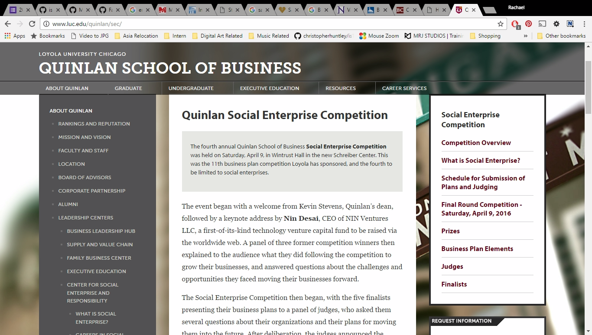
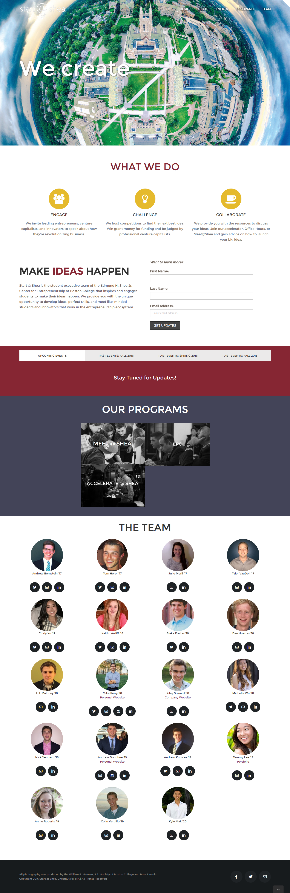

```html
<!--- Students that attract funding will be entered into the Summer Fellows program at the Fairfield University Entrepreneurship Laboratory (FUEL) where expert mentors will guide them through the process of launching their companies. The summer program will conclude with a second investor Showcase event where the startups can attract direct investment from local investors and alumni.
--->
```

#Loyola University Chicago

http://luc.edu/quinlan/sec/

*Social enterprises today must take into account not only profitability, but also the business’s impact on the environment and people in the society.*

Similar to Fairfield, Loyola University Chicago's Social Enterprise Competition consist of finalists presenting their respective business plans to a panel of judges, who ask them several questions about their organizations and their plans for moving them into the future. The competition provides participants with a venue to develop confidence and interdisciplinary skills. The top five business plans are chosen to present to judges who are successful investors and professionals serving in today’s business market. Lastly, cash prizes are awarded to the top three business plans to provide capital to take the team’s business idea and continue to move toward fruition.

To make the site simple yet sophisticated, a transparent content area is centered against the background image. The links pertaining to related sites for assistance are listed in a black .5 transparent expanded footer.

#Boston College's Accelerate@Shea

http://www.startatshea.com/

Similar to Fairfield's FEUL program, Boston College's Accelerate@Shea, is a 6-week program that provides student startups with *expert advice, space, and funding to launch and grow their business.*

The collapsed scrolling style of the website makes it easy to navigate. The landing page is divided into two sections: "How It Works" and "Teams". The graphic displayed in the first section briefly outlines the components of the program. The "Teams" section displays the teams in two columns. The respective website and social media accounts are located underneath the team's picture. Once the user hovers over the picture of the group, a brief blurb about the team is shown.
